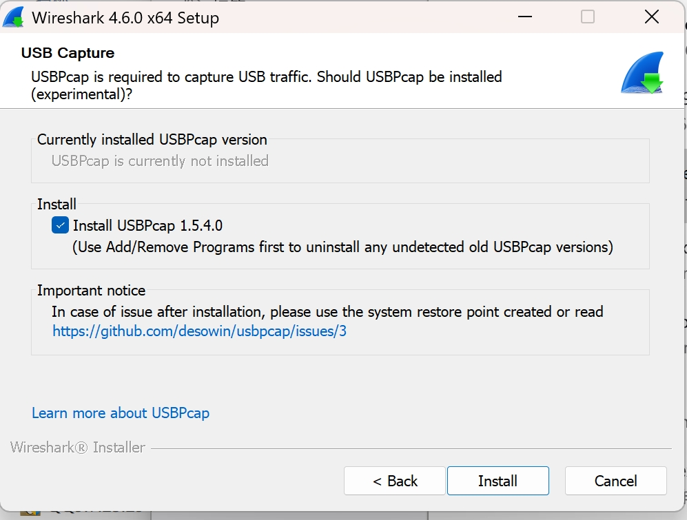
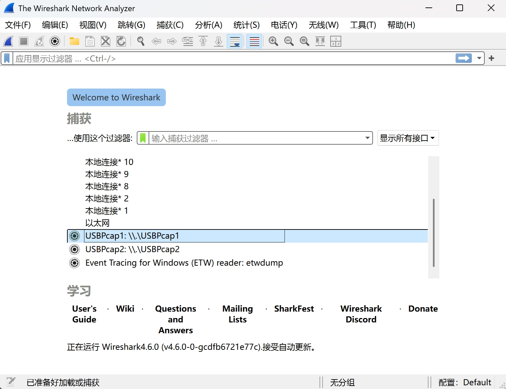
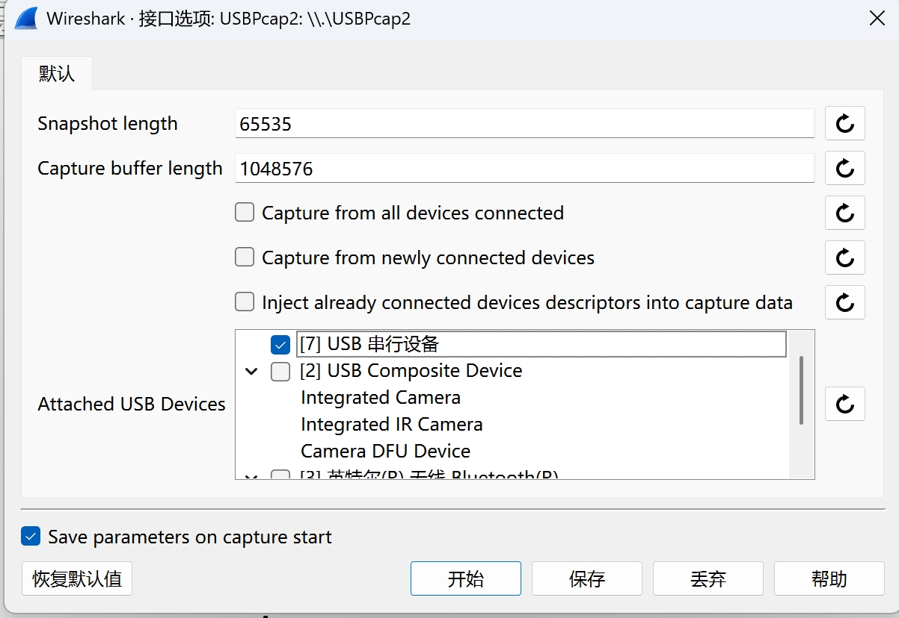
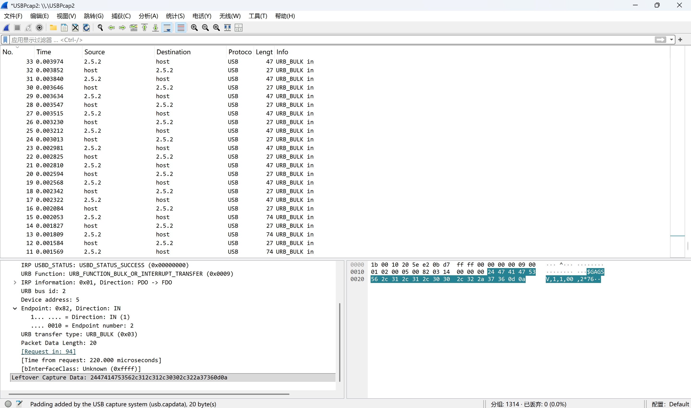
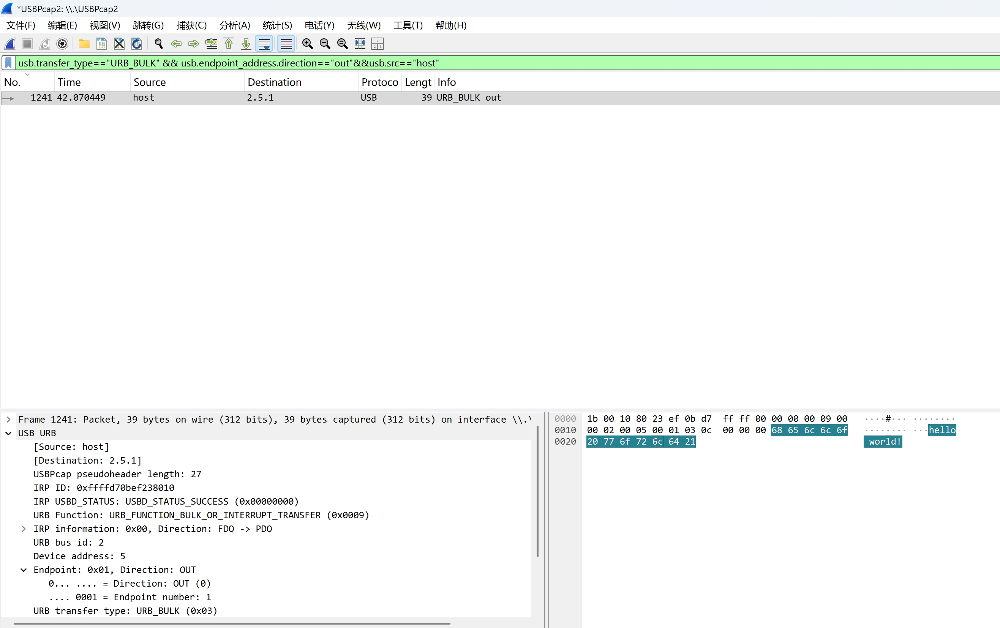

Wireshark 是一款开源免费的网络协议分析工具，支持跨 Windows、macOS、Linux 等多操作系统，核心功能是实时捕获网络中的数据包，并以可视化界面展示数据传输细节。它不仅能分析以太网、Wi-Fi 等传统网络数据，还可通过扩展组件支持 USB、串口等总线数据抓取。

## 一、安装 Wireshark

通过 [Wireshark 官方下载链接](https://www.wireshark.org/#download) 获取对应系统的安装包。由于抓取 USB 数据还需要 USBPcap，需额外安装 USBPcap 组件。Wireshark 默认不安装 USBPcap，在运行安装包，按向导完成基础配置后，在组件选择界面手动勾选「USBPcap」。其余安装选项可保持默认，按提示接受协议许可，完成安装后重启计算机，确保组件生效。

## 二、抓取串口数据

### 2.1 配置 Wireshark 捕获

- 打开 Wireshark 软件，如下图所示，正确安装 USBPcap 后应当能够找到 USBPcap 的捕获选项，选项数据会由设备的 USB 接口数量而有所不同。为了便于识别串口设备，建议在捕获时移除电脑上多余的 USB 设备，避免冗余设备干扰目标串口的识别。

- 点击 USBPcap 旁的齿轮图标，可以检查该端口关联的设备。如下图所示，一般而言，串口设备会显示为「USB 串行设备」，也可以尝试插拔串口设备并重新打开该软件界面来确定目标设备。

- 捕获的配置如上图所示，但暂不要选择「开始」。

### 2.2 配置上位机软件（串口数据发送端）

- 启动上位机软件，按实际需求完成串口参数配置（如波特率、数据位、校验位、停止位等）。
- 建立与目标串口设备的连接，打开串口后，通过测试验证数据收发正常，确保通信链路通畅。

### 2.3 开始捕获

- 回到 Wireshark 界面，点击「确定」开始数据捕获。如下图所示，在捕获界面中理应出现大量的数据帧，否则就应当检查设备连接和设备选择是否正确。

- 在上位机软件中选择发送串口命令，接着在 Wireshark 界面的左上角选择「停止捕获分组」，串口传输的所有数据将被完整捕获并保存。

## 三、分析串口数据

- 最后通过对捕获到的数据帧进行分析，就能找到需要的串口命令。Wireshark 捕获的数据帧主要为接收机发出的 NMEA 报文，为避免这些数据的干扰，在上方的「应用显示过滤器」中填入过滤规则 ：
  
  `usb.transfer_type=="URB_BULK" && usb.endpoint_address.direction=="out" && usb.src=="host"`
  
  这条规则的含义是
  - `usb.transfer_type=="URB_BULK"`：数据帧类型为 `URB_BULK`（串口通信常用的批量数据交换格式）
  - `usb.endpoint_address.direction=="out"`：数据帧发送方向为 `out`（由计算机设备向外部设备）
  - `usb.src=="host"`：数据帧来自于计算机设备
  

- 在过滤后的数据帧可以快速定位目标指令。如上图所示，鼠标悬浮至右下侧文本的最后一段数据上，查看高亮标注的数据帧载荷，如示例中发送的串口指令为 `hello world!`，十六进制格式为 `68 65 6c 6c 6f 20 77 6f 72 6c 64 21`，在蓝色高亮处被标记出来。
